# Lab Hack Nexus - Documentação Técnica

## 📋 Índice

1. [Visão Geral](#visão-geral)
2. [Diagramas UML](#diagramas-uml)
3. [Como Gerar os Diagramas](#como-gerar-os-diagramas)
4. [Estrutura da Documentação](#estrutura-da-documentação)
5. [Instalação do PlantUML](#instalação-do-plantuml)

## 🎯 Visão Geral

Esta pasta contém toda a documentação técnica do projeto Lab Hack Nexus, incluindo diagramas UML, especificações de arquitetura e guias de desenvolvimento.

## 📊 Diagramas UML

### Diagramas Disponíveis

| Diagrama | Arquivo | Descrição |
|----------|---------|-----------|
| **Arquitetura do Sistema** | `plantuml-system-architecture.puml` | Visão geral da arquitetura, componentes e suas interações |
| **Fluxo de Dados** | `plantuml-data-flow.puml` | Como os dados fluem através do sistema |
| **Componentes** | `plantuml-component-diagram.puml` | Estrutura de componentes React e sua organização |
| **Sequência da API** | `plantuml-api-sequence.puml` | Fluxo de criação de posts e interações com a API |
| **Jornada do Usuário** | `plantuml-user-journey.puml` | Fluxo completo do usuário na plataforma |
| **Fluxo de Autenticação** | `plantuml-authentication-flow.puml` | Processo de login, registro e autenticação |
| **Schema do Banco** | `plantuml-database-schema.puml` | Estrutura das tabelas e relacionamentos |
| **Infraestrutura** | `plantuml-infrastructure.puml` | Arquitetura de infraestrutura e deployment |
| **Deployment** | `plantuml-deployment.puml` | Configuração de containers e serviços |
| **Modelo de Segurança** | `plantuml-security-model.puml` | Camadas de segurança e proteções implementadas |

### Imagens Geradas

As imagens PNG dos diagramas são geradas automaticamente e estão disponíveis na mesma pasta:

- `System_Architecture.png`
- `Component_Diagram.png`
- `API_Sequence.png`
- E outras...

## 🛠️ Como Gerar os Diagramas

### Opção 1: Online (PlantUML Server)

1. Copie o conteúdo do arquivo `.puml`
2. Acesse [PlantUML Online Server](http://www.plantuml.com/plantuml/uml/)
3. Cole o código e clique em "Submit"
4. Baixe a imagem gerada

### Opção 2: VS Code Extension

1. Instale a extensão "PlantUML" no VS Code
2. Abra o arquivo `.puml`
3. Use `Ctrl+Shift+P` e digite "PlantUML: Preview Current Diagram"
4. Para exportar: "PlantUML: Export Current Diagram"

### Opção 3: Linha de Comando

```bash
# Instalar PlantUML
npm install -g node-plantuml

# Gerar um diagrama específico
puml generate plantuml-system-architecture.puml

# Gerar todos os diagramas
puml generate *.puml
```

### Opção 4: Docker

```bash
# Usar container PlantUML
docker run --rm -v ${PWD}:/data plantuml/plantuml:latest -tpng "/data/*.puml"
```

## 📁 Estrutura da Documentação

```
Docs/
├── README.md                           # Este arquivo
├── documentacao-completa.md            # Documentação técnica completa
│
├── plantuml-system-architecture.puml   # Arquitetura geral
├── plantuml-component-diagram.puml     # Componentes React
├── plantuml-api-sequence.puml          # Sequências da API
├── plantuml-user-journey.puml          # Jornada do usuário
├── plantuml-authentication-flow.puml   # Fluxo de autenticação
├── plantuml-database-schema.puml       # Schema do banco
├── plantuml-data-flow.puml             # Fluxo de dados
├── plantuml-infrastructure.puml        # Infraestrutura
├── plantuml-deployment.puml            # Deployment
├── plantuml-security-model.puml        # Modelo de segurança
│
└── *.png                               # Imagens geradas
```

## 🔧 Instalação do PlantUML

### Windows (PowerShell)

```powershell
# Instalar via Chocolatey
choco install plantuml

# Ou via Scoop
scoop install plantuml

# Ou baixar JAR diretamente
Invoke-WebRequest -Uri "https://github.com/plantuml/plantuml/releases/latest/download/plantuml.jar" -OutFile "plantuml.jar"
```

### Usando Node.js

```bash
npm install -g @plantuml/cli
```

### Verificar Instalação

```bash
plantuml -version
```

## 🎨 Personalização dos Diagramas

### Temas Disponíveis

Os diagramas usam tema personalizado, mas você pode alterar:

```plantuml
!theme plain          # Tema padrão (atual)
!theme cerulean      # Tema azul
!theme sandstone     # Tema bege
!theme slate         # Tema escuro
```

### Cores Personalizadas

```plantuml
skinparam backgroundColor #F8F9FA
!define PRIMARY_COLOR #2563EB
!define SECONDARY_COLOR #10B981
```

## 📝 Convenções

### Nomenclatura de Arquivos

- `plantuml-*` - Arquivos fonte PlantUML
- `*` - Arquivos sem prefixo são imagens geradas
- Usar kebab-case para nomes de arquivos

### Estrutura dos Diagramas

1. **Header**: Configuração de tema e título
2. **Definições**: Cores e estilos personalizados
3. **Conteúdo**: Elementos do diagrama
4. **Conexões**: Relacionamentos e fluxos
5. **Notas**: Explicações e detalhes adicionais

### Exemplo de Estrutura

```plantuml
@startuml Diagram_Name
!theme plain
skinparam backgroundColor #F8F9FA

title Project Name - Diagram Title

' Definições de cores
!define PRIMARY_COLOR #2563EB

' Conteúdo do diagrama
component "Component A" as comp_a
component "Component B" as comp_b

' Conexões
comp_a --> comp_b : "relationship"

' Notas explicativas
note right of comp_a
  Detailed explanation
  of the component
end note

@enduml
```



## 🚀 Scripts de Automação

### Gerar Todos os Diagramas

```powershell
# Windows PowerShell
Get-ChildItem -Filter "plantuml-*.puml" | ForEach-Object {
    plantuml -tpng $_.Name
}
```

```bash
# Linux/Mac
for file in plantuml-*.puml; do
    plantuml -tpng "$file"
done
```

### Script de Build

Crie um arquivo `build-diagrams.ps1`:

```powershell
#!/usr/bin/env pwsh

Write-Host "🔄 Gerando diagramas PlantUML..." -ForegroundColor Blue

$pumlFiles = Get-ChildItem -Filter "plantuml-*.puml"

foreach ($file in $pumlFiles) {
    Write-Host "📊 Processando: $($file.Name)" -ForegroundColor Green
    plantuml -tpng $file.Name
    
    if ($LASTEXITCODE -eq 0) {
        Write-Host "✅ $($file.Name) gerado com sucesso" -ForegroundColor Green
    } else {
        Write-Host "❌ Erro ao gerar $($file.Name)" -ForegroundColor Red
    }
}

Write-Host "🎉 Processo concluído!" -ForegroundColor Cyan
```

Execute com:

```powershell
.\build-diagrams.ps1
```

## 📚 Recursos Adicionais

### Documentação PlantUML

- [Guia Oficial](https://plantuml.com/guide)
- [Referência de Sintaxe](https://plantuml.com/sitemap-language-specification)
- [Galeria de Exemplos](https://real-world-plantuml.com/)

### Ferramentas Recomendadas

- **VS Code**: PlantUML Extension
- **IntelliJ**: PlantUML Integration Plugin
- **Online**: PlantUML Server
- **Desktop**: PlantUML QEditor

## 🤝 Contribuição

Para contribuir com a documentação:

1. Crie/edite os arquivos `.puml`
2. Gere as imagens correspondentes
3. Atualize este README se necessário
4. Teste a geração dos diagramas
5. Submeta um Pull Request

## 📄 Licença

Esta documentação faz parte do projeto Lab Hack Nexus e segue a mesma licença do projeto principal.
